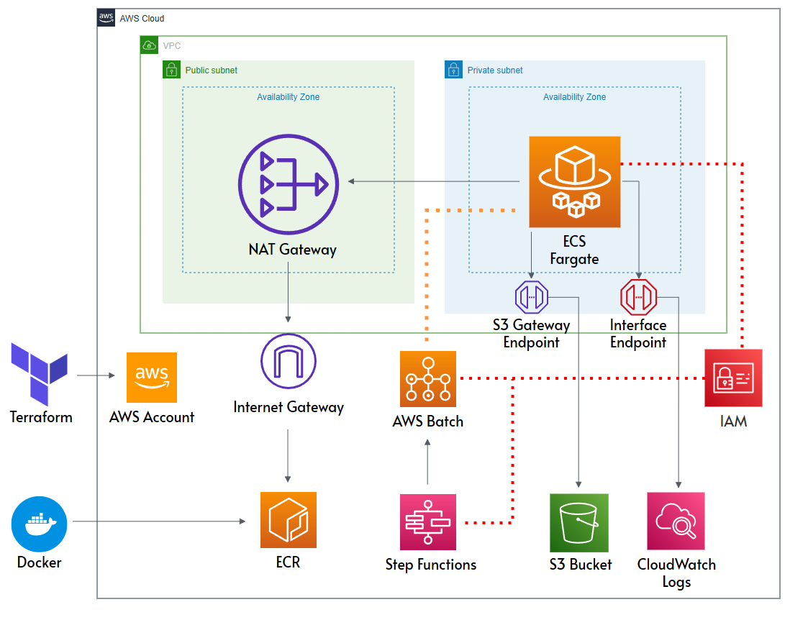

# AI Data ETL Pipeline

**AI Pretraining Data Pipeline** for large-scale LLM training. Ingests Common Crawl WET files and other sources into AWS S3 and processes them via a modular ETL workflow using AWS Batch, Step Functions, Terraform, and Docker. Features multilingual detection (fastText), content extraction (jusText), toxicity filtering (Detoxify), and S3-based logging for full reproducibility.

---

## Project Overview
This pipeline is designed to support **LLM pretraining** by automating the ingestion, filtering, and preprocessing of large-scale datasets.  
It’s optimized for **AWS Batch + Step Functions orchestration**, **containerized execution**, and **infrastructure as code** with Terraform.

**Key capabilities:**
- **Data ingestion** from Common Crawl WET files, including keyword detection in URLs and page content
- **Text filtering** with language detection (fastText) and jusText body extraction
- **Toxicity filtering** with Detoxify prediction and toxicity threshold
- **Deduplication** using MinHash for file-level and global duplicates
- **Normalization & tokenization** with ftfy, Moses, and SentencePiece
- **Scalable & modular** AWS-based architecture

---

## Architecture



**Core AWS Services:**
- **IAM** – Least-privilege roles for Batch jobs, Step Functions, and S3 access
- **VPC** – Isolated networking with public NAT for pulling ECR images and private subnets for Batch tasks
- **S3** – Stores all pipeline input/output plus stage-level logs
- **AWS Batch (Fargate)** – Runs containerized ETL stages without EC2 provisioning
- **ECR** – Stores Docker images for each processing stage
- **Step Functions (Map State)** – Automates orchestration of multiple Batch jobs in parallel
- **CloudWatch Logs** – Centralized logging of all container output

**Pipeline Flow:**
1. **Ingestion** – Download & extract text from WET files into `s3://.../extracted/`
2. **Filtering** – Apply language, HTML, and content filters → `s3://.../filtered/`
3. **Detoxification** – Integrates Detoxify for toxicity filtering → `s3://.../detoxified/`
4. **Deduplication** – Remove duplicates → `s3://.../deduplicated/`
5. **Global Deduplication** – Remove duplicates across deduped files → `s3://.../global_deduplicated/`
6. **Normalization** – Unicode cleanup, casing, punctuation handling → `s3://.../normalized/`
7. **Tokenization** – SentencePiece tokenization for LLaMA-style models → `s3://.../tokenized/`
8. **Logging** – Write per-stage processing metrics to S3 logs

---

## Tech Stack
- **Python 3.10**
- **AWS Batch (Fargate)**
- **AWS Step Functions**
- **Amazon S3**
- **Terraform**
- **Docker**
- **fastText** (language detection)
- **jusText** (HTML/main text extraction)
- **Detoxify** (toxicity filtering)
- **ftfy / Moses / SentencePiece** (normalization & tokenization)

---

## Deployment
**Build & push Docker image:**
```bash
docker build -t my-pipeline -f emr-docker/Dockerfile .
docker tag my-pipeline:latest <aws_account_id>.dkr.ecr.<region>.amazonaws.com/my-pipeline:latest
docker push <aws_account_id>.dkr.ecr.<region>.amazonaws.com/my-pipeline:latest
```

**Deploy AWS infrastructure with Terraform:**
```bash
cd terraform
terraform init
terraform apply
```

---

## Logging & Monitoring
- **S3 logs** – Stage-level metrics written to s3://my-cc-pipeline-s3/logs/
- **CloudWatch** – Real-time container logs for each Batch task
- **Step Functions console** – Visual DAG execution tracking

---

## Results
- Processes 100 Common Crawl WET files in parallel, scalable horizontally and vertically
- Produces clean, deduplicated, and tokenized datasets ready for LLM pretraining
